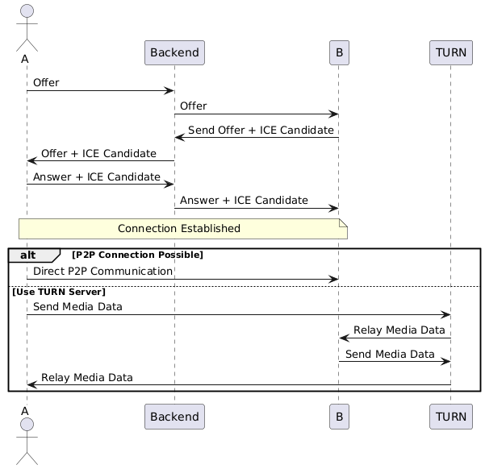

# RTCBridge — Real-Time Video Calling App

RTCBridge is a full-stack real-time video calling application built using **WebRTC** and **WebSockets**. 
It enables seamless peer-to-peer communication with low latency and reliable connectivity across networks 
using STUN/TURN servers. The backend is built using **Spring Boot** and 
the frontend uses **HTML**, **CSS**, **JavaScript**, along with **STOMP Client** and
**SockJS** for WebSocket communication.

---

## Features

- 🔴 One-to-one real-time video and audio communication
- 🔌 WebSocket-based signaling using STOMP protocol
- ⚡ Low-latency peer-to-peer streaming via WebRTC
- 🌐 STUN/TURN integration for NAT traversal
- 🎯 Dynamic client connection (no hardcoded IPs)
- 💻 Responsive and interactive frontend UI

---

## Tech Stack

### Backend
- **Spring Boot** — REST APIs & WebSocket server
- **WebSockets (STOMP)** — Signaling mechanism 
- **WebRTC** — Peer-to-peer communication

### 🎨 Frontend
- **HTML, CSS, JavaScript** — UI
- **SockJS + STOMP Client** — WebSocket communication

---

## System Design
The application uses WebRTC for establishing peer-to-peer communication. A Spring Boot server acts as the signaling server 
to exchange metadata between peers (SDP and ICE candidates) using WebSockets.

**Diagram</h3>
<p>Below is the system design diagram illustrating the flow of the application:</p>


---

## How to Run

### Prerequisites
- Java 17+
- Maven 3.8+

---

### Steps

```bash
# Clone repository
git clone <your-repo-url>

# Navigate to project
cd Video-Call

# Build project
./mvnw clean package -DskipTests

# Run application
java -jar target/webrtc-0.0.1-SNAPSHOT.jar

```

### Open in browser

The server runs on **HTTPS port 3000** (required for WebRTC camera access):

```
https://localhost:3000
```

> ⚠️ Your browser will show a security warning for the self-signed certificate.
> Click **"Advanced" → "Proceed to localhost"** to continue.

### Testing two users locally

Open two browser tabs/windows:
- **Tab 1:** Enter ID `alice`, click Connect
- **Tab 2:** Enter ID `bob`, click Connect
- In Tab 1, type `bob` in Remote ID and click Call
- Accept in Tab 2

## SSL Certificate Note

The keystore (`keystore.p12`) uses password `Mandi@2226` and alias `tomcat`.
WebRTC *requires* HTTPS/secure context for camera/microphone access — do not remove SSL.

To generate a fresh self-signed cert:
```bash
keytool -genkeypair -alias tomcat -keyalg RSA -keysize 2048 \
  -storetype PKCS12 -keystore src/main/resources/keystore.p12 \
  -validity 3650 -storepass Mandi@2226
```

## How It Works

1. **Signaling**
    - The client connects to the Spring Boot WebSocket server
    - Users exchange SDP (Session Description Protocol) and ICE (Interactive Connectivity Establishment) candidates via WebSockets

2. **WebRTC Peer Connection**
    - WebRTC APIs establish a direct peer-to-peer connection between users for audio and video streaming

3. **Media Stream**
    - Local media streams are captured using WebRTC and shared over the peer connection

---

## Contributing

Contributions are welcome!  
Feel free to fork the repository and submit a pull request with your changes 🚀

---
